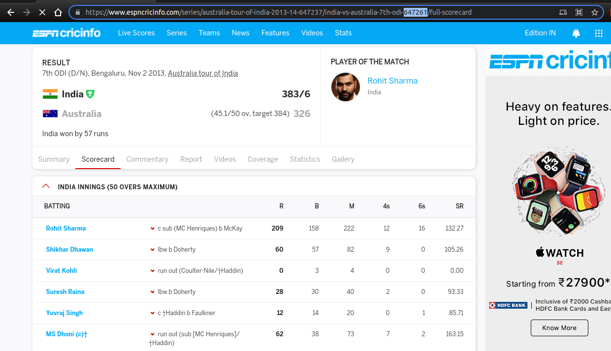

# python-cricket-scraper

python-cricket-scraper is built to get cricket data from [Cricsheet](https://cricsheet.org/) and [ESPNCricInfo](https://www.espncricinfo.com/)

## Installation

Use the package manager [pip](https://pypi.org/) to install python-cricket-scraper.

```bash
pip3 install python-cricket-scraper
```
---
## Usage

### CricSheet files
**1. using single file**
```python
from cricscraper.cricsheet import CricSheet

sheet = CricSheet(files=["647261.yaml"])
sheet.save()
```

**2. using multiple files**
```python
from cricscraper.cricsheet import CricSheet

sheets = CricSheet(files=["647261.yaml", "792295.yaml", "1122727.yaml"])
sheets.save()
```

**3. using files in a folder**
```python
from cricscraper.cricsheet import CricSheet

sheets = CricSheet(folder="folder/")
sheets.save()
```
```save()``` method saves the CSV file, containing columns(mentioned ahead).

Notice that ***files***  parameter takes list, whereas ***folder*** takes name of folder as a string.

---
### Using CricInfo class
CricInfo class takes match id to scrape the data.

**Q.** Where can I get match id? 

**A.** Google any cricket match you want. Visit Espncricinfo and get match id from url(highlighted number). `647261` in this case




```python
from cricscraper.cricinfo import CricInfo

match = CricInfo("647261")
match.match_name()
match.match_dates()
match.playing11()
match.summary()
match.scorecard()
```
There are many more methods in CricInfo class. I'll encourage you to check other methods using 
```
help(CricInfo)
```

### Using CricSheet & CricInfo class together
```python
from cricscraper.cricsheet import CricSheet

sheet = CricSheet(files=["647261.yaml", "792295.yaml"])
data = sheet.get_more_info()
```
```get_more_info()``` returns dictionary of ```CricInfo``` object, match id as key

---
## Columns of CSV file
1. **match id** - match id of the match as per ESPNCricInfo records.
2. **inning** - Inning number.
3. **delivery** - delivery number.
4. **over** - Over number.
5. **batsman** - batsman on strike.
6. **non striker** - batsman on non-strike.
7. **bowler** - Bowler.
8. **runs off bat** - runs scored by batsman on particular delivery.
9. **extras** - Extra runs of particular delivery.
10. **total** - team total until particular delivery.
11. **extra kind** - extra kind (byes, legbyes, widea or no ball)
12. **wicket kind** - wicket kind (caught, bowled or lbw etc)
13. **player out** - Player dismissed.
14. **fielders** - Fielders involved in the wicket(caught, stumping etc).
15. **team1** - Playing team1.
16. **team2** - Playing team2.
17. **outcome** - Match outcome type (normal - team1 or team2 won, draw - Match Drawn etc)
18. **winner** - Match winner
19. **by** - win by runs, wickets or innings (India won by 6 wickets, then by = wickets)
20. **win amount** - Margin of victory (India won by 6 wickets, then win amount = 6)
21. **player of match** - Player of match.
22. **toss winner** - Toss winner.
23. **toss decision** - Chosen bat or bowl.
24. **match type** - Match format(ODI, ODM, TEST etc)
25. **venue** - Venue.
26. **city** - City of venue.
27. **gender** - Male or female.
28. **umpire1** - Standing umpire 1
29. **umpire2** - Standing umpire 2

---

## Contributing
Pull requests are welcome. For major changes, please open an issue first to discuss what you would like to change.

---
## License
[MIT](https://choosealicense.com/licenses/mit/)

